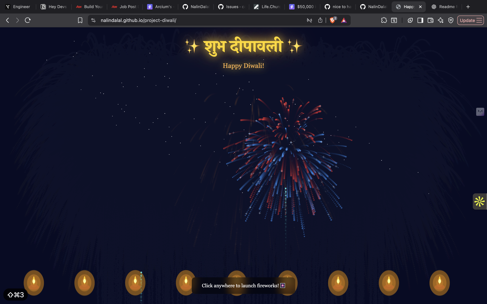

# Diwali Lights Animation – p5.js

A vibrant interactive Diwali-themed animation built using [p5.js](https://p5js.org/), celebrating the festival of lights with flickering diyas, fireworks, and colorful effects.

## Demo

[Live Demo Link](https://nalindalal.github.io/project-diwali/)

## Features

- Flickering diyas with realistic glow.
- Colorful fireworks on click or at random intervals.
- Animated background with gradient sky and stars.
- Responsive design for desktop and mobile screens.
- Background music or sound effects (optional).

## Screenshots



## Installation

### Option 1: Run Locally

1. Clone the repository:

   ```bash
   git clone https://github.com/your-username/p5js-diwali.git
   cd p5js-diwali
   ```

2. Open `index.html` in your browser.

### Option 2: Using p5.js Web Editor

1. Go to [p5.js Web Editor](https://editor.p5js.org/).
2. Copy the contents of `sketch.js` and `index.html` into a new project.
3. Run the sketch directly in the editor.

## Usage

- Click anywhere on the canvas to trigger fireworks.
- Enjoy the animated diyas lighting up the scene.
- Optional: Enable background music by including an audio file in `assets` and uncommenting the audio lines in `sketch.js`.

## Dependencies

- [p5.js](https://p5js.org/) (included via CDN in `index.html`)

## Project Structure

```
p5js-diwali/
│
├─ index.html       # Main HTML file
├─ sketch.js        # Main p5.js sketch
├─ style.css        # Optional CSS for styling
├─ assets/          # Images, audio, or other media
└─ README.md        # Project documentation
```

## Contributing

Contributions are welcome! You can:

- Add more animations (like rangoli, lanterns, etc.).
- Improve fireworks or diya effects.
- Optimize performance for mobile devices.

## License

This project is licensed under the MIT License. See [LICENSE](./LICENSE) for details.

---

✨ **Happy Diwali! May your code shine as bright as the diyas!** ✨
